<!-- Generated by GitHub Profile Agent Console. Edit profile.config.json, then run npm run generate. -->

  <picture>
    <source media="(max-width: 760px) and (prefers-color-scheme: dark)" srcset="./assets/hero/agent-console-16da587d-mobile-dark.svg">
    <source media="(max-width: 760px)" srcset="./assets/hero/agent-console-16da587d-mobile-light.svg">
    <source media="(prefers-color-scheme: dark)" srcset="./assets/hero/agent-console-16da587d-dark.svg">
    <source media="(prefers-color-scheme: light)" srcset="./assets/hero/agent-console-16da587d-light.svg">
    
  </picture>

  
  

## About Me

I am a Programmer and Web/Mobile Application Developer graduated from STMIK Pontianak (S.Kom.), specializing in high-performance frontend and backend systems.

I focus on writing clean, efficient, and well-structured code. I am active on GitHub exploring open-source repositories and collaborating with teams on real-world projects.

## Current Focus

| Area | What I am exploring |
| --- | --- |
| **Web Systems** | Building reactive and SEO-optimized web applications with SvelteKit, Laravel, Next.js, and React. |
| **Mobile Engineering** | Developing cross-platform and native mobile applications using NativeScript, React Native, and Android Studio. |
| **Database Architecture** | Designing and managing relational and non-relational database architectures with clean REST API integrations. |

## Featured Work

| Project | Focus | Why it matters |
| --- | --- | --- |
| [**Traffic Barang**](https://stokbarang.toupsscomputer.store) | SvelteKit & MySQL Inventory System | Inventory management and automated traffic logging platform built for PT. Segi Tiga Asia. Tracks stock level, supplier, and sale reports. |
| [**Toup SS Computer**](https://toupsscomputer.store) | Digital Catalog & Web App | Platform for game top-ups, mobile vouchers, and electricity tokens with a direct customer support portal built with SvelteKit and NativeScript. |
| [**SS Computer Portal**](https://hadisscomp8899.com/index.php) | PHP Client Ticket Portal | Custom web application focusing on customer services registration, ticketing, and computer repair catalogs. |
| [**Kustore Design**](https://www.figma.com/design/0a3xf4Es9rulq8jTNhysJx/KUSTORE---APPS-TOP-UP?m=auto&t=JR60opJ7bcSbhUCf-6) | Figma Mobile App UI/UX | High-fidelity user interface design and prototype for a game top-up application featuring dark mode and seamless checkout. |
| [**Indoflazz Design**](https://www.figma.com/design/cOw38OiRVTzcFC0OehxsHD/INDOFLAZZ---APPS-TOP-UP?node-id=0-1&t=IRyFyWObC5rIqOpH-1) | Figma Mobile App UI/UX | Interface design and interactive prototype for Indoflazz mobile top-up app, blending modern dark mode aesthetics with concise product listings. |
| [**KPR Rumah Impian**](https://www.figma.com/design/eGkUYijgJV3PHujg5lsHFT/Landing-Page-KPR-Rumah-Impian?node-id=0-1&t=HvSnZHm8n1D0EjFh-0) | Figma Web Landing Page | Figma landing page design for home ownership credit (KPR), featuring an intuitive mortgage calculator and high-impact CTA sections. |

## Research Direction

I am dedicated to engineering high-performance web and mobile software. I focus on developing clean, responsive frontends and well-optimized backend systems that solve practical business problems.

## Tech Stack

`SvelteKit` · `NativeScript` · `Laravel` · `Next.js` · `React` · `Node.js` · `MySQL` · `PostgreSQL` · `PHP` · `TypeScript` · `Android Studio` · `TailwindCSS` · `Figma`

## Recent Activity

<!-- AUTO:ACTIVITY:START -->
_Recent public activity will appear here after the workflow runs._
<!-- AUTO:ACTIVITY:END -->

---

  Building efficient digital solutions and sharing open source systems.

